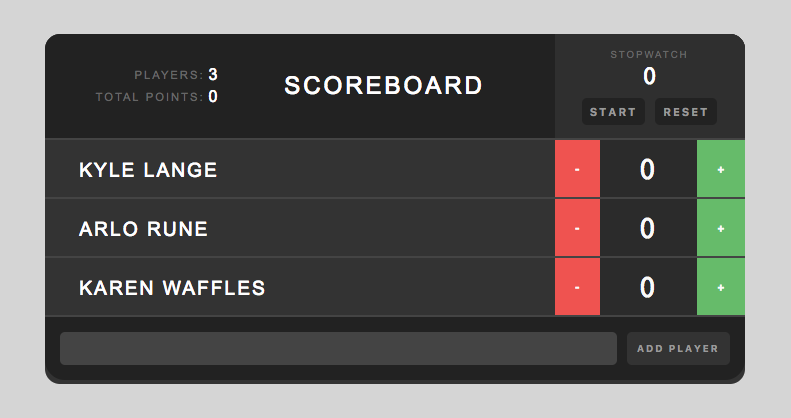

# _React-Scoreboard_

#### _{an app that allows a user to add players/remove players, changes and calculates individual and total score, and has a stopwatch that can be reset}, {Jan 22nd}_

#### By _**Kyle Lange**_

## Learnings

* State:

## Setup/Installation Requirements

1. Download this repo using your terminal: git clone repo-name pasted here

3. View the code by drag-and-dropping the file into your [favorite text editor](https://atom.io)

3. with npm and react installed, all a user has to do is enter the main file in your terminal and type:

        npm start

run/check-out the program by going to http://localhost:8080/

4. [This site can explain the FULL build process](https://www.tutorialspoint.com/reactjs/reactjs_environment_setup.htm)
## Known Bugs

_There are no known bugs as of the last commit. Please send an ISSUE on github in the repository if you see something I have not._

## Support and contact details

For questions or comments, please __email  [Kyle here.](baronsintrees@gmail.com)__

## Technologies Used

* React.js
* Scss
* Babel + Webpack

### License

Copyright (c) 2016 **_Kyle Lange_**

This program is free software: you can redistribute it and/or modify
    it under the terms of the GNU General Public License as published by
    the Free Software Foundation, either version 3 of the License, or
    (at your option) any later version.

    This program is distributed in the hope that it will be useful,
    but WITHOUT ANY WARRANTY; without even the implied warranty of
    MERCHANTABILITY or FITNESS FOR A PARTICULAR PURPOSE.  See the
    GNU General Public License for more details.

    You should have received a copy of the GNU General Public License
    along with this program.  If not, see <http://www.gnu.org/licenses/>.
